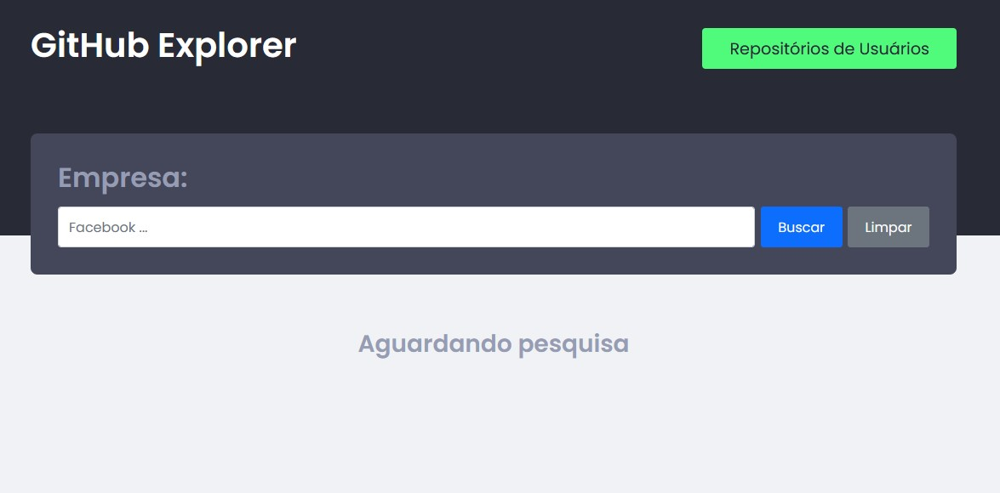

# GitHub Explorer - Fast Track 2022

> After clone project and access folder:

## ✨ Install dependencies (node_modules)

```shell
yarn
```

## 🚀 Run project

```shell
yarn dev
```

## 💻 Open browser

```shell
http://localhost:3000/
```

## 🧰 Technologies

```md
Axios
Bootstrap
React
Context-api
React Router Dom
Redux
Redux Saga
styled-components
```

## ⚙️ API

```md
https://api.github.com
```

## 🖼️ Print



### Made with ❤️ by Leonardo Brizolla

#### Enjoy 😊
